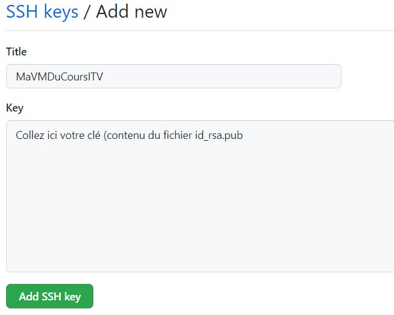
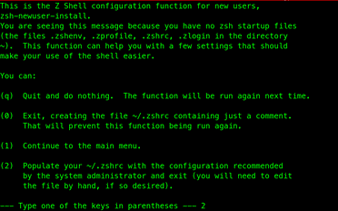

# Exercice 1 – Installation d'un client Ubuntu  

### Informations  
- Évaluation : formative  
- Type de travail : individuel  
- Durée : 2 heures  
- Système d'exploitation : Linux Ubuntu 24.04  
- Environnement : virtuel, vSphere

### Objectifs :

Cet exercice a pour objectifs :  

- D'installer un environnement de travail client/serveur

Dans cet exercice, vous allez vous installer un environnement de travail pour la majorité des exercices et des travaux pratiques du cours. Vous allez utiliser un client Linux Ubuntu, mais comme nous allons installer des logiciels serveur, il va faire également office de serveur.  

> **Attention :** ne tapez pas les commandes dans le terminal de votre VM sans comprendre ce que vous faites !  
> Utilisez les pages man pour comprendre les commandes et les options. De plus, le copier/coller des commandes dans le terminal est une mauvaise idée.  

## Partie 1 : Installation d’Ubuntu 
Dans cette partie, vous allez installer un serveur Ubuntu selon les spécifications données.  

> **Attention :** vous pouvez installer vos VMs à la maison ou sur le vSphere du cégep. Par contre, je ne peux pas garantir que le vSphere sera toujours disponible cet automne.  

### Étape 1 : Installation  

a - En utilisant l’ISO ubuntu-24.04-desktop-amd64.iso, créez une machine virtuelle selon les spécifications suivantes :  

    Dossier dans vSphere : DFC DS/VM DFC/E25_4372_420W45_ISS_CR/  
    Nom de la VM : E25_4372_Ub_Cli_Initiale_#Matricule   
    Storage (disque vSphere) : ESXDFC2  
    CPU : 2  
    Mémoires : 8 Go  
    Disque dur : 2 disques, 25 Go chacun en **partitionnement dynamique (Thin provision)**  
    **Attention**: Si vous avez oublié d'ajouter le deuxième disque lors de la configuration initiale, vous devrez modifier la configuration avant le démarrage pour ajouter un deuxième disque.  
    Carte réseau : VM DFC2 (réseau 10.100.2.0)  
    CD/DVD : ISO ubuntu-24.04-desktop-amd64.iso  
    Carte vidéo : Activer le support 3D  

À la maison : Utiliser les mêmes informations pour les CPUs et le disque. Vous pouvez utiliser la version d’Ubuntu que vous désirez, mais au minimum 24.04.  

b -	Une fois la VM créée, lancez la VM et installez le client Ubuntu selon les spécifications suivantes :

    Clavier : French (Canada) et English (US), le duexième clavier put être ajout après l'installation.  
    Mise à jour disponible : Ignorer (si demandé).  
    Type d'installation : Installation interactive.  
    Optimisez votre ordinateur : ne rien choisir.  
    Application et mise à jour : Installation par défaut.  
    Configuration du disque : Fonctions avancées et utiliser LVM pour la nouvelle installation d'Ubuntu. Acceptez le partitionnement proposé, sélectionnez le premier disque et continuez.  
    Utilisateur : utiliser la première lettre de votre prénom suivi de votre nom. Par exemple, croy.  
 

## Partie 2 : Première utilisation de votre machine

Démarrez votre VM et connectez-vous.

### Mise à jour de votre Ubuntu

Si vous ne l'avez pas encore fait, lors de l'installation, faites une mise à jour de votre système : 

```bash
sudo apt update && sudo apt full-upgrade -y  
```

**Question** : Quelle est l'utilité des deux perluètes (&&) ?

<details>
	<summary markdown="span">Réponse :</summary>
	La deuxième commande ne s’exécutera que si la première commande s’est exécutée avec succès, c’est-à-dire si son code de sortie est zéro. Cet opérateur peut être utilisé pour vérifier si la première commande s’est exécutée correctement. C’est l’une des commandes les plus utilisées en ligne de commande.  
	
</details>

**Question** : Quelle est la différence entre ces deux commandes ?  

<details>
	<summary markdown="span">Réponse :</summary>
	<code>apt update</code> : met à jour la liste des paquets disponibles à partir des dépôts configurés dans /etc/apt/sources.list. <br>  
	<code>apt full-upgrade</code> : Met à jour tous les paquets installés en tenant compte des changements de dépendances, même si cela nécessite de supprimer des paquets. Bref, ça installe les mise à jour des paquets. Ça peut supprimer ou remplacer des paquets pour satisfaire de nouvelles dépendances. Par contre, `apt upgrade` met à jour sans jamais supprimer de paquets.  
</details>

### Installer les VM tools

Installez les VM tools : 

```bash
sudo apt install open-vm-tools open-vm-tools-desktop -y  
```


### Générer une clé SSH

Générer une clé SSH sur votre machine locale. La clé va vous permettre de vous connecter à un serveur distant, comme par exemple GitHub.

Pour ce faire entrer la commande suivante à la racine de votre dossier usager. 

```bash
#Vérifier que vous êtes à la racine de votre $USER
pwd
#Sortie attendu votre répertoire usager:
/home/prof
# Générer la clé SSH en changeant le courriel pour le votre :
ssh-keygen -t ed25519 -N '' -C "email@example.com"
# Une fois que vous aurez entré cette commande, une question va apparaître :
Enter file in which to save the key (/home/xxxxx/.ssh/ed25519):
```  

En général, il est recommandé de laisser tel quel (appuyez sur ENTRÉE sans taper quoi que ce soit) afin que le générateur de clé puisse créer la clé à l’emplacement par défaut. Les questions qui apparaîtront ensuite :

Pour des raisons de commodité, nous n'avons pas créé de phrase secrète (la chaîne de caractère après -N est vide). De cette façon, après avoir configuré la clé avec votre serveur distant, vous n’aurez pas besoin d’utiliser un mot de passe pour vous connecter. Vous allez entrer <code>ssh utilisateur@ipduserveur</code> et vous serez immédiatement connecté. Mais si vous avez besoin de plus de sécurité, vous pouvez entrer une phrase secrète (passphrase) avec le paramètre <code>-N</code> . Si vous choisissez cette option, vous devrez entrer le mot de passe chaque fois que vous vous connectez au serveur distant.

L’image générée est l’empreinte numérique de la clé.

Il y a deux clés qui ont été créées ici ( PRIVEE et PUBLIQUE ): id\_ed25519 et id\_ed25519.pub. Elles sont situées dans le dossier caché .ssh de votre répertoire home.  

**IMPORTANT! Prenez soin du fichier nommé id_ed25519 (c’est la clé privée ), gardez-la sur votre ordinateur et ne le donnez à personne.**

```bash
ls -al .ssh
cat .ssh/id_ed25519.pub
```

Le fichier id\_ed25519.pub est la clé publique, elle doit être copiée sur votre serveur distant. Par exemple, dans votre profil GitHub dans Setting -> SSH and GPG Keys -> New SSH Key. Dans ce cas, vous faites une copie du contenu id\_ed25519.pub et vous le collez dans l'espace dans le champ prévu à cet effet (key) et donnez un nom significatif à votre clé dans Title:



Par la suite, vous pourrez vous connecter avec le mode ssh à tous vos dépôts github.

### Vérification des partitions et du système

- Ouvrez un terminal et entrez la commande suivante :

```
df -h
```

**Question** : À quoi servent la commande <code>df</code> et son paramètre -h ?

Utiliser la page man pour répondre

```
man df
```

Cette commande vous permet d’avoir l’espace utilisé et disponible pour chaque partition du système de fichier qui est monté.

Vous devriez pouvoir identifier vos partitions créées lors de l’installation. Le paramètre -h (Human-readable) utilise des suffixes d'unité : octet, kilo-octet, mégaoctet, gigaoctet, téraoctet et pétaoctet afin de réduire le nombre de chiffres à trois ou moins en utilisant la base 2 pour les tailles.

Ici il y a deux partitions qui nous intéressent davantage :

```bash
# La partition LVM probablement : 
/dev/mapper/ubuntu--vg-ubuntu--lv
# La partition de boot/efi probablement :
/dev/sda2
```

Remarquer les valeurs d'utilisation.


### Gestion des partitions, la commande lsblk :

Un périphérique de bloc est un fichier faisant référence à un périphérique. Les périphériques peuvent être des disques durs, des disques SDD, des disques RAM, etc. Les fichiers de périphérique de bloc se trouvent dans le répertoire /dev.

-  Entrer la commande suivante, et avec la page man vérifier les informations données sur la commande.

```bash
lsblk
# sda, ce sont les données sur votre premier disque dur.

#sdb, ce sont les données sur votre deuxième disque dur non utilisé. Nous allons le configurer dans un autre exercice.
```


Il est également possible d’avoir des informations en mode graphique. Pour ce faire, utiliser l’utilitaire Disques (Disks). 

— Cliquez sur chaque partition pour pouvoir accéder aux informations. Vérifier les points de montage.


### Mémoire RAM, processeur et processus

Dans un terminal, taper la commande `top` :

```bash  
top 
```

La commande `top` vous permet d’avoir une vue dynamique en temps réel du processus, de la mémoire et du processeur.

Pour quittez `top` entrer `q`.

Il existe de meilleures alternatives à `top` : htop et bashtop. Mais, vous devez les installer.

## Partie 3 : Ajout de services et configurations

Dans cette partie, vous allez ajouter les logiciels wget, curl, git, Visual Studio Code et Docker et faire quelques configurations supplémentaires.


### Étape 2 : Ajout de logiciels de base

a- Nous allons installer les outils de base wget, curl et git. Pour ceux qui le désire, vous pouvez également ajouter vim.

```bash
sudo apt install wget curl git vim -y
```

b. Installez Visual Studio Code (https://code.visualstudio.com/) ou VSCodium (https://vscodium.com) et suivez les instructions pour Linux Ubuntu.

### Étape 3: Ajout de Docker  

a.	Il existe plusieurs manières d’installer Docker. Nous allons utiliser le script officiel de Docker pour l’installer (vous pouvez consulter le script à https://get.docker.com).

```bash
curl -fsSL https://get.docker.com -o get-docker.sh
sh get-docker.sh
sudo usermod -aG docker VotreNomUtilisateur
sudo docker version 
```

Avec ces commandes, vous avez installé Docker, vous avez ajouté votre utilisateur au groupe Docker (ça évite de toujours utiliser `sudo` devant vos commandes Docker, par contre ce n’est pas une bonne habitude de sécurité) et vous avez vérifié que Docker est bien installé.

Vous devez relancer votre session pour que votre utilisateur soit inclus dans le groupe docker.

b.	Plusieurs des exercices se feront sous Docker. Vous pouvez également installer Docker sous votre Windows ou Mac.

Docker sous Windows : [https://docs.docker.com/desktop/install/windows-install/](https://docs.docker.com/desktop/install/windows-install/).  
Docker sous MAC : [https://docs.docker.com/desktop/install/mac-install/](https://docs.docker.com/desktop/install/mac-install/).


### Étape 4 : Configuration supplémentaire

Nous allons faire une configuration supplémentaire, on va installer le shell zshell, un shell plus fonctionnel que le bash.

a. Vérifier les shell présents sur votre Ubuntu :  

```bash
echo $SHELL
cat /etc/shells #vous donne les shell existant sur votre poste
```
	
b. Si zsh n'est pas listé, installer le.

```bash
sudo apt install zsh -y

```  

c. Vérifier la présence du shell.

```bash
zsh --version
```

b. Changez votre shell par défaut pour zsh.

```bash
chsh -s $(which zsh)
```


Pour voir le changement, vous devez ouvrir une nouvelle fenêtre de commandes. À la fenêtre ci-dessous, répondez 2 pour peupler le fichier ~/.zshrc.

[]

c.	Pour pouvoir personnaliser l’apparence, vous devez installer oh-my-zsh.

```bash
sh -c "$(curl -fsSL https://raw.githubusercontent.com/robbyrussell/oh-my-zsh/master/tools/install.sh)"
```

La configuration de oh-my-zsh se fait par le fichier $HOME/.zshrc et les fichiers de configurations se trouve sous $HOME/.oh-my-zsh/. Vous pouvez installer le thème que vous voulez, voir le lien de référence.

d.	Un thème intéressant que je recommande est Powerlevel10k. Vous devez installer les polices du thème avant d’installer le thème.

```bash
cd $HOME/Downloads # Téléchargements en français

wget https://github.com/romkatv/powerlevel10k-media/raw/master/MesloLGS%20NF%20Regular.ttf

wget https://github.com/romkatv/powerlevel10k-media/raw/master/MesloLGS%20NF%20Bold.ttf

wget https://github.com/romkatv/powerlevel10k-media/raw/master/MesloLGS%20NF%20Italic.ttf

wget https://github.com/romkatv/powerlevel10k-media/raw/master/MesloLGS%20NF%20Bold%20Italic.ttf

```

Pour installer les polices, vous ouvrez le répertoire (dossier) Downloads et vous double-cliquez sur chacune des polices.

Voici les commandes pour installer le thème.

```bash
cd  
git clone --depth=1 https://github.com/romkatv/powerlevel10k.git ~/powerlevel10k
echo 'source ~/powerlevel10k/powerlevel10k.zsh-theme' >> ~/.zshrc
```

Vous devez ouvrir un nouveau terminal et un wizard va vous aider à configurer le thème.

Vous pouvez relancer la configuration avec la commande :  

```bash
p10k configure
```

## Pour vérification
Remettre une capture d’écran de votre Linux avec un shell d’ouvert ayant les commandes suivantes exécutées à l'intérieur :

```bash
git version
docker --version
docker compose version

**Attention** Si vous déposé plus d'une version, je ne corrige que le dernier dépôt fait sur LÉA dans travaux.

```
## Compétences développées


00Q1 - Effectuer l’installation et la gestion d’ordinateur :

    2 installer le système d’exploitation.
    3 Installer des applications
    4 Effectuer des tâches de gestion du système d’exploitation.

00SF - Évaluer des composants logiciels et matériels

    1 Rechercher des composants logiciels et matériels.
    2 Formuler des avis sur les composants logiciels et matériels.

Note : les compétences sont développées en partie.

## Références
- Ubuntu : [https://ubuntu.com/download/desktop](https://ubuntu.com/download/desktop)
- LVM : [https://access.redhat.com/documentation/fr-fr/red_hat_enterprise_linux/6/html/logical_volume_manager_administration/index](https://access.redhat.com/documentation/fr-fr/red_hat_enterprise_linux/6/html/logical_volume_manager_administration/index)
- zsh : [https://kifarunix.com/install-and-setup-zsh-and-oh-my-zsh-on-ubuntu-20-04/](https://kifarunix.com/install-and-setup-zsh-and-oh-my-zsh-on-ubuntu-20-04/)
- Powerlevel10k : [https://github.com/romkatv/powerlevel10k](https://github.com/romkatv/powerlevel10k)
