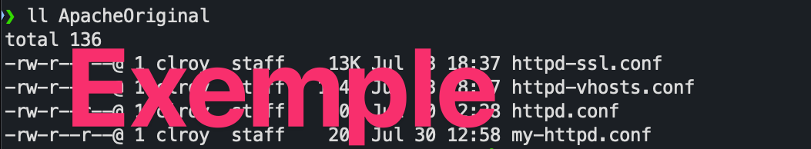

#  Exercice 12 :  Apache

### Informations
- Évaluation : formative.
- Type de travail : individuel
- Durée estimée : 2 heures.
- Système d'exploitation : Ubuntu client.
- Environnement : Docker.  

### Objectifs  

- Installer le serveur Web Apache
- Faire une configuration de base

Dans cet exercice, vous allez installer un environnement de serveur Web (HTTP) Apache (httpd), regarder sa configuration de base et modifier quelques paramètres.

Note : si vous fermez votre VM, n’oubliez pas d’arrêter vos conteneurs :

```bash
	docker container stop nom_conteneur

	docker container start nom_conteneur
``` 

## Section 1 : Installation d'Apache
Dans cette partie, vous allez installer le serveur Web Apache selon les spécifications données.

### Étape 1 : Installation

1. Pour débuter, on doit trouver une image qui nous intéresse. Aller sur le site Web [hub.docker.com](https://hub.docker.com) ( docker hub est un dépôt pour mettre nos images, il est aussi possible de récupérer des images faites par d’autres personnes). Si ce n’est pas déjà fait, inscrivez-vous. Une fois connecté, faites une recherche pour httpd (apache). Vous pouvez voir qu’il y a plus de 20 000 images. L’image officielle est la httpd éditée par la fondation Apache. C'est celle dont nous allons nous servir. Cliquez `httpd` et vous allez avoir toute l’information pour vous servir de l’image.

2. Avant de lancer notre serveur, on va se créer un espace de travail qui sera utilisé pour les prochains exercices. 

- À partir de votre répertoire (dossier) $HOME, créer un répertoire Dev et à l’intérieur un répertoire Sites. Vous devriez avoir la structure suivante :

```bash
/home/$user/Dev/Sites
# Exemple :
/home/jpduches/Dev/Sites
```
**Sauf si on vous le précise, vous travaillerez toujours à partir de cette espace.**

3.	Entrez dans le répertoire Sites et exécutez la commande recommandée pour lancer l’image httpd.

```bash
docker run -dit --name my-apache-app -p 8080:80 -v $(pwd):/usr/local/apache2/htdocs/ httpd:2.4
```
<details>
<summary>Pour rappel voici ce que fait la commande : </summary>

- Docker lance un conteneur qui exécute un serveur web Apache en arrière-plan, accessible depuis votre navigateur à l'adresse http://localhost:8080. Les fichiers de votre répertoire de travail sont automatiquement partagés avec le serveur web à l'intérieur du conteneur.

- Les options ```-dit``` dans votre commande servent à définir le mode d'exécution du conteneur Docker que vous lancez. Voyons chacune d'elles :

    ```d``` (detached) : Cette option indique à Docker d'exécuter le conteneur en arrière-plan. Cela signifie que le conteneur continuera de fonctionner même si vous fermez votre terminal. Il ne sera pas attaché à votre session interactive.

    ```i``` (interactive) : Bien que présente, cette option n'est pas réellement utilisée dans votre cas spécifique, car le conteneur est en mode détaché. Elle est généralement utilisée pour obtenir une interface interactive avec le conteneur, comme si vous étiez connecté à un terminal à l'intérieur.

    ```t``` (TTY): Cette option alloue un pseudo-TTY au conteneur. Un TTY est un terminal virtuel qui permet d'interagir avec une application en mode texte. Cependant, comme le conteneur est en mode détaché, cette option n'est pas nécessaire ici. Par contre, elles pourraient être utiles si vous aviez besoin d'interagir avec le conteneur de manière interactive plus tard.


Le reste de la commande :

- ```docker run``` : c'est la commande de base pour exécuter un nouveau conteneur Docker.

-  ```--name my-apache-app``` : attribue un nom au conteneur pour faciliter son identification.

- ```-p 8080:80``` : mappe le port 80 du conteneur (celui utilisé par Apache) au port 8080 de votre machine hôte. Cela vous permet d'accéder au serveur web en utilisant http://localhost:8080.
  
- ```-v $(pwd):/usr/local/apache2/htdocs/``` : monte le répertoire courant de votre machine hôte dans le répertoire ```/usr/local/apache2/htdocs/``` du conteneur. Cela signifie que les fichiers que vous placez dans votre répertoire courant seront accessibles par le serveur web à l'intérieur du conteneur.

- ```httpd:2.4``` : spécifie l'image Docker à utiliser. Dans ce cas, c'est une image contenant un serveur web Apache version 2.4.

</details>

### Vérification de l'installation

- Vérifiez que votre image s’exécute bien.  

```bash
docker container ls
```  

- Vérifier les ports qui écoutent sur votre poste local :  

```bash
ss -tnap | grep 8080
```  

- Ouvrez un navigateur et allez au site Web [http://localhost:8080](http://localhost:8080).

**ATTENTION : la majorité des navigateurs ajoute par défaut le ***https*** et non le ***http***, donc pour ne pas avoir d'erreur, il est essentiel de le taper ***http//:localhost:8080*** et non ***localhost:8080***.**

Avez-vous une page Web? Sinon, pourquoi?

<details>
<summary>Réponse.</summary>
Non. On n’a pas de fichier index.html.
</details>

- Dans le répertoire Sites ajouter une page Web index.html avec le contenu ci-dessous (vous pouvez l’améliorer à votre goût) et rafraîchir la page de votre navigateur.

```html
<html>
  <title>Apache test</title>
  <body>
    <p>Wow! Une page Web!</p>
  </body>
</html>
```

Si vous n'avez pas de page Web, dépanner.

## Section 2 : Configurations
Dans cette partie, vous allez regarder la configuration par défaut et faire quelques changements.

### Configuration par défaut

Allez sur le site de la documentation d’Apache, [https://httpd.apache.org/docs/2.4/getting-started.html](https://httpd.apache.org/docs/2.4/getting-started.html), et répondez aux questions suivantes :

1.	Quel fichier sur votre VM devez-vous modifier pour pouvoir résoudre un nom de domaine local (serveur qui n’a pas accès à Internet et n’est pas présent dans un DNS) ?  
2.	Quel est l’endroit, répertoire, par défaut des fichiers de configuration ?  
3.	Quel est le nom du fichier de configuration ?  
4.	Quelle est l’utilité de la directive Include ?  
5.	Comment configure-t-on un serveur Apache ?  
6.	Où dois-je mettre une directive ?  
7.	Où est placé le fichier .htaccess et quelle est son utilité ?  
8.	Quelle directive permet de spécifie où dans votre système de fichiers vous devez placer les fichiers de votre site Web ?  
9.	Quelle directive définit l’emplacement du journal d’erreurs ?  
10.	Est-ce que cette directive est seulement globale ou elle peut être définie par hôte virtuel ?  


<details>
<summary>Réponse.</summary>

1.	Quel fichier sur votre VM devez-vous modifier pour pouvoir résoudre un nom de domaine local (serveur qui n’a pas accès à Internet et n’est pas présent dans un DNS).
```/etc/hosts ou C:\Windows\system32\drivers\etc\hosts``  

2.	Quel est l’endroit, répertoire, par défaut des fichiers de configuration ?  
```/usr/local/apache2/conf```  

3.	Quel est le nom du fichier de configuration ?  
httpd.conf  

4.	Quelle est l’utilité de la directive ```Include``` ?  
The configuration is frequently broken into multiple smaller files, for ease of management. These files are loaded via the Include directive.  

5.	Comment configure-t-on un serveur Apache ?  
The server is configured by placing configuration directives in these configuration files. A directive is a keyword followed by one or more arguments that set its value.  

6.	Où dois-je mettre une directive ?  
The question of "Where should I put that directive?" is generally answered by considering where you want a directive to be effective. If it is a global setting, it should appear in the configuration file, outside of any ```<Directory>```, ```<Location>```, ```<VirtualHost>```, or other section. If it is to apply only to a particular directory, then it should go inside a ```<Directory>``` section referring to that directory, and so on.   

7.	Où est placé le fichier ```.htaccess```ß et quelle est son utilité ?  
In addition to the main configuration files, certain directives may go in ```.htaccess ``` files located in the content directories. ```.htaccess ``` files are primarily for people who do not have access to the main server configuration file(s).  

8.	Quelle directive permet de spécifie où dans votre système de fichiers vous devez placer les fichiers de votre site Web ?  
The ```DocumentRoot``` directive specifies where in your filesystem you should place these files. This directive is either set globally, or per virtual host. Look in your configuration file(s) to determine how this is set for your server.  

9.	Quelle directive définit l’emplacement du journal d’erreurs ?  
The location of the error log is defined by the ```ErrorLog``` directive.  

10.	Est-ce que cette directive est seulement globale ou elle peut être définie par hôte virtuel ?  
Elle peut être définie globalement ou par hôte virtuel.  
</details>


### Consultation des configurations par défaut

1.	Connectez-vous sur votre serveur en ligne de commande.  

```bash
docker container exec -it my-apache-app bash
```


2.	Déplacez-vous dans le répertoire de configuration et ouvrez le fichier de configuration par défaut. 

Répondez aux questions suivantes :

**Note** : vous devrez installer un éditeur de texte (soit nano ou vim).

```bash
apt update && apt install nano -y
# ou
apt update && apt install vim -y
```

 2.1 Quelle est l’utilité de la directive ```ServerRoot``` ? 

 2.2 Quelle est l’utilité de la directive ```Listen``` ?
  
 2.3 Sous quel utilisateur et groupe s’exécute httpd ? 

 2.4 Quelle est l’utilité de la directive ```ServerName``` ? 

 2.5 Quel est le répertoire pour les fichiers du site Web par défaut ?

<details>
<summary>Réponse.</summary>
2.1 Donne le répertoire des fichiers de configuration.  
2.2 Définis le port l’adresse IP et/ou port.  
2.3 www-data  
2.4 Définis le nom et le port utilisés par le serveur pour s’identifier.  
2.5 ```/usr/local/apache2/htdocs```  

</details>  

3.	Déplacez-vous dans le répertoire extra et regardez ce qu’il contient. Regarder le contenu des fichiers ```httpd-default.conf```, ```httpd-manual.conf``` et ```httpd-vhosts.conf```  

### Modification des configurations du serveur Apache

- Modifiez le fichier ```/etc/hosts``` de votre VM pour ajouter que 127.0.0.1 pointe à www.monsite.com.
Ouvrez Firefox et entrez votre site Web : [http://www.monsite.com:8080](http://www.monsite.com:8080).

Avez-vous votre page Web?
	
<details>
<summary>Réponse :</summary>
Oui!
</details>

- Nous allons changer le répertoire du site Web par défaut.

- Regarder les droits du répertoire par défaut ```/usr/local/apache2/htdocs``` (dans le shell de votre conteneur) et notez les informations  

- Créer le répertoire ```/srv/htdocs``` et si nécessaire changer les droits (```chmod 755```) du répertoire pour avoir les mêmes que celui par défaut.

- Faire une copie de sauvegarde du fichier de configuration de ```httpd.conf```.

- Modifiez l’entrée dans le fichier ```httpd.conf``` pour que le répertoire des documents par défaut devienne ```/srv/htdocs``` (vous avez deux entrées à modifier)  

<details>
<summary>Réponse :</summary>  
	
```bash
	mkdir /srv/htdocs
	cp /usr/local/apache2/conf/httpd.conf /usr/local/apache2/conf/httpd.conf.orig
	nano /usr/local/apache2/conf/httpd.conf  
	
```  
	
 Modifiez les directives :

 ```DocumentRoot "/srv/htdocs"```
 et 
 ```<Directory "/srv/htdocs">```  
 
</details>

   
- Relancer le serveur httpd : ```apachectl restart```. (Le message d’erreur sur le nom de domaine est normal).

- Déplacez-vous dans le répertoire ```/srv/htdocs```, créer un document toto.txt comme suit :

```bash
	echo "Information personnelle" > toto.txt
```  

- Rafraîchir la page de Firefox.
- Que s’est-il passé?  

<details>
<summary>Réponse :</summary>
On voit le listage du répertoire de documents par défaut. On peut également consulter les documents et les télécharger.
</details>

- Modifiez le nom de votre fichier à ```index.html``` et rafraîchir la page de Firefox.
- Que s’est-il passé?  

<details>
<summary>Réponse :</summary>
On voit l'information contenue dans le document index.html, on ne voit plus le listage du répertoire.   
</details>

- Déplacez-vous dans le répertoire de configuration d’Apache. Ouvrez le fichier de configuration ```httpd.conf```.  
- Rechercher la ligne avec une directive pour les journaux d'accès : ```#CustomLog "logs/access_log" combined```.  
- Ajouter la directive sur la ligne en dessous pour que nos journaux contiennent les traces des connexions :  

		```CustomLog "logs/access_log" common```  

- Relancez le serveur httpd et consultez les fichiers de journaux avec la commande ```tail```. 

```bash
  tail /usr/local/apache2/logs/access_log
```

- Si vous n’avez pas de log, rafraîchir la page Web.

- Exécuter la commande ```tail``` avec le paramètre ```-f``` et rafraîchir votre page Web quelques fois. 
- Que permet le paramètre ```-f``` ?  

<details>
<summary>Réponse :</summary>
L'option -f fait que tail ne s'arrête pas lorsque la fin du fichier est atteinte, mais attend plutôt que des données supplémentaires soient ajoutées à l'entrée.
</details>

- Dans le fichier ```httpd.conf```,faite en sorte d'inclure le fichier de configuration des configurations par défauts (rechercher ```httpd-default.conf``` dans le fichier et le décommenter).
   
- Quittez le conteneur en tapant exit.

### Copie des fichiers de configuration

Nous allons récupérer quelques fichiers de configurations dans le but de pouvoir les réutiliser plus tard.

La commande ```docker container cp``` ([https://docs.docker.com/reference/cli/docker/container/cp/](https://docs.docker.com/reference/cli/docker/container/cp/)) nous permet de copier des fichiers d'un conteneur à notre hôte :

```bash
$ docker container cp my-apache-app:/usr/local/apache2/conf/httpd.conf my-httpd.conf
$ docker container cp my-apache-app:/usr/local/apache2/conf/httpd.conf.orig httpd.conf  
...
```

- Copier, dans le répertoire de votre hôte, les fichiers ```httpd.conf``` (celui modifié et la copie de l’original), ```httpd-vhosts.conf``` et ```httpd-ssl.conf```(les deux derniers sont dans le répertoire ```/usr/local/apache2/conf/extra```).

Conserver ces documents dans un répertoire à part, car nous allons utiliser ces fichiers lors des prochains exercices Apache.

Vous pouvez arrêter et effacer votre conteneur.

## Pour vérification

Remettre une capture d'écran démontrant les fichiers Apache récupérés.

  
**Figure 1 : exemple de réponse.**

## Références

[https://docs.docker.com/reference/cli/docker/container/cp/](https://docs.docker.com/reference/cli/docker/container/cp/)