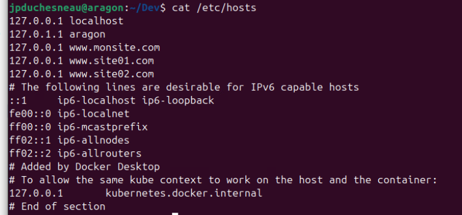
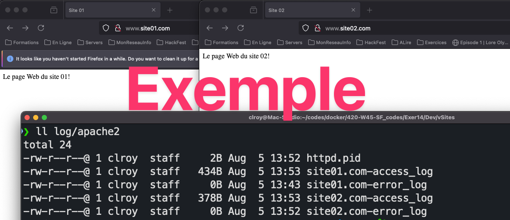

#  Exercice 14 :  Apache, installation d'un site Web et site virtuel

## Informations
- Évaluation : formative.  
- Type de travail : individuel.  
- Durée estimée : 3 heures.  
- Système d'exploitation : Ubuntu client.  
- Environnement : Docker.  

## Objectifs  

-	Faire une installation complète d’un site Web.  
- Installer des sites Web virtuels.  

Dans cet exercice, vous allez compléter l’installation de l’exercice précédent pour ajouter un logiciel de base de données à votre installation. Vous allez également créer différents hôtes sur le même serveur à l’aide du principe d’hôtes virtuels.


## Section 1 : Site Web complet
Dans cette partie, vous allez installer le serveur Web Apache selon les spécifications données.

### Étape 1 : Préparer la structure de répertoire

Je vous rappelle la structure de répertoire que nous avons.  

```bash
  /home/$user/Dev/Sites/
                  |--compose.yaml
                  |--monsite/
                    |--Dockerfile
                    |--certs
                      |--server.crt
                      |--server.key
                    |conf/
                      |--httpd.conf
                      |--http-ssl.conf
                    |html/
                      |--index.html
                      |--index.php
                  |--php/
                    |--Dockerfile 
```  

-	Pour pouvoir vérifier php avec MariaDB, nous allons changer le fichier ```index.php``` dans le répertoire ```monsite/html``` avec le code suivant :  

```php
<h1>Je te test!</h1>
<h4>Tentative de connexion MariaDB depuis PHP...</h4>
<?php 
$host = 'mariadb';
$user = $_ENV["DB_USER"];
$pass = $_ENV["DB_PASSWD"];
$conn = new mysqli($host, $user, $pass);

if ($conn->connect_error) {
    die("La connexion a échoué: " . $conn->connect_error);
} 
echo "Connexion réussie à MariaDB!";
?>
```

### Étape 2 : PHP et MariaDB avec Apache  

-	Modifier votre fichier ```compose.yaml``` pour les variables d'environnement de php et inclure MariaDB.  

```yaml
---
services:
  php:
    build: './php/'
    networks:
      - backend
    environment:
      - DB_USER=root
      - DB_PASSWD=rootpassword
    volumes:
      - ./monsite/html:/srv/htdocs
  apache:
    build: './monsite/'
    depends_on:
      - php
    networks:
      - frontend
      - backend
    ports:
      - "8080:80"
    volumes:
      - ./monsite/html:/srv/htdocs
  mariadb:
    image: mariadb:latest
    networks:
      - backend
    environment:
      - MYSQL_ROOT_PASSWORD=rootpassword
networks:
    frontend:
    backend:

```  

Vous pouvez remarquer qu’il nous manque un volume pour la base de données, car dans cet exemple nous n’avons pas encore de base de données.  

- Modifier le Dockerfile de php pour inclure mysqli.  

```yaml
# Pour image de php
# Utilise une petite image
FROM php:fpm-alpine

# Met a jour le serveur
RUN apk update; \
    apk upgrade;

# Install mysqli extension  permettant d'utiliser la bd dans PHP
RUN docker-php-ext-install mysqli

```  

­<details>
<summary>Explication du fichier Dockerfile :</summary>  

```RUN docker-php-ext-install mysqli```

- ```RUN``` : il s'agit d'une instruction Dockerfile qui exécute une commande pendant le processus de construction d'une image Docker.  
- ```docker-php-ext-install``` : c'est une commande qui installe des extensions PHP dans un conteneur Docker. Elle fait partie de l'image Docker officielle de PHP.  
- ```mysqli``` : C'est le nom de l'extension PHP à installer. MySQLi est une extension MySQL pour PHP qui vous permet d'accéder aux bases de données MySQL.

Donc en résumé :

Lorsque vous exécutez cette commande dans un fichier Docker, elle installe l'extension MySQLi pour PHP dans le conteneur Docker. Cela permet à votre application PHP de se connecter aux bases de données MySQL.

***Générer avec Explain Code de BlackBox AI.
Traduit avec www.DeepL.com/Translator (version gratuite)***  

</details>  

-	Lancez vos conteneurs et allez à la page [https://www.monsite.com](https://www.monsite.com). Il se peut que la connexion échoue à la première tentative.  
- Est-ce que votre site Web fonctionne avec MariaDB ? Si non dépanné  
- Arrêter vos conteneurs.  

  ```bash
  docker-compose down
  ```

## Section 2 : Site Web virtuel

Apache prend en charge la création de sites Web séparés au sein d'un même serveur et permet de garder le contenu séparé. Les sites individuels sont configurés sur le même serveur dans ce que l'on appelle des hôtes virtuels.
Le terme hôte virtuel fait référence à la pratique consistant à exécuter plusieurs sites Web (tels que societe1.exemple.com et societe2.exemple.com) sur une seule machine.  

Les hôtes virtuels peuvent être «basés sur IP», ce qui signifie que vous avez une adresse IP différente pour chaque site Web, ou «basés sur le nom», ce qui signifie que vous avez plusieurs noms en cours d'exécution sur chaque adresse IP. Le fait qu'ils s'exécutent sur le même serveur physique n'est pas perçu par l'utilisateur final.
Nous allons nous concentrer sur les hôtes virtuels «basés sur le nom».  

### Site par défaut  
- Créer un répertoire ```vSites``` sous ```Dev``` et créer la structure de répertoire suivante :  

```bash
    /home/$user/Dev
                   /vSites/
                   |--conf/
                   |--site01/
                     |--html/
                   |--site02/
                     |--html/
```

- Copier votre fichier ```index.html``` créé dans l’exercice 12 dans le répertoire ```html``` de site01 et site02.  

- Modifier les fichiers pour pouvoir identifier clairement les sites.  

-	Créer un Dockerfile dans vSites pour créer une image httpd:latest. Dans l’image, exposer les ports 80 et 443.

-	Créer un fichier compose.yaml pour construire et lancer le conteneur httpd:latest que vous allez appeler apache, exposer le port 80 au port 80 du conteneur et créer un point de montage du répertoire ```site01/html``` vers le répertoire ```/usr/local/apache2/htdocs``` du conteneur.  

-	Modifier le fichier hosts de votre VM pour ajouter www.site01.com avec 127.0.0.1.  

Voici à quoi devrait ressembler votre fichier.  
  
**Figure 1 : exemple du fichier /etc/hosts.**  

-	Lancer votre système avec ```docker-compose up```.  

- Vérifier que ça fonctionne avec Firefox (si vous avez un problème d’atteindre [www.site01.com](http://www.site01.com), vous pouvez relancer votre système pour le forcer à lire le fichier hosts).  

**Attention** : Si vous suivez bien la logique, les trois URL suivantes, localhost, wwww.site01.com et www.site02.com devraient vous mener à la page du site01 étant donné que notre seul point de montage est fait sur site01.  

- Utilisez la commande ```docker container cp``` pour récupérez le fichier de configuration ```httpd.conf```.  

```bash  
$ docker container cp vsites-apache-1:/usr/local/apache2/conf/httpd.conf conf/
```
-	Arrêter votre système.  

```bash
docker-compose down
```  

Nous devons d'abord modifier le fichier ```vSites/conf/httpd.conf``` pour pouvoir inclure le fichier ```httpd-vhosts.conf```.

- Modifier le fichier ```vSites/conf/httpd.conf``` :  

 ```bash  
# Pour inclure le fichier http-vhosts.conf
# Enlever le commentaire devant la ligne suivante
Include conf/extra/httpd-vhosts.conf

```  

- Copier le ficher ```httpd-vhosts.conf``` récupérer de l’exercice 12 dans ```vSites/conf```.

Lorsque vous ajoutez un hôte virtuel basé sur le nom (namebased) à un serveur existant et que les arguments d'hôte virtuel correspondent à des combinaisons IP et de port préexistant, les demandes seront désormais traitées par un hôte virtuel explicite. Dans ce cas, il est généralement judicieux de créer un hôte virtuel par défaut avec un ```ServerName``` correspondant à celui du serveur de base. 

Les hôtes virtuels basés sur le nom pour l'ensemble des ```<virtualhost>``` sont traités dans l'ordre dans lequel ils apparaissent dans la configuration. Le premier ```ServerName``` ou ```ServerAlias``` correspondant est utilisé, sans priorité différente pour les caractères génériques (ni pour ```ServerName``` et ```ServerAlias```).  

Donc, le premier conteneur ```<VirtualHost *:80>``` dans le fichier ```httpd-vhosts.conf``` devient notre serveur par défaut.  

- Modifier le fichier ```httpd-vhosts.conf``` pour que le premier conteneur corresponde à notre serveur actuel (vous pouvez mettre le conteneur du deuxième site Web dummy-host2.example.com en commentaire ou l’effacer).  

 ```bash
<VirtualHost *:80>
    ServerAdmin clroy@csfoy.ca
    DocumentRoot "/usr/local/apache2/site01.com"
    ServerName site01.com
    ServerAlias www.site01.com
    ErrorLog "logs/site01.com-error_log"
    CustomLog "logs/site01.com-access_log" common
</VirtualHost>
 ```  

- Modifier le fichier Dockerfile pour ajouter le nouveau répertoire (```DocumentRoot```) tel que défini plus haut.  

<details>
<summary>Modification du fichier Dockerfile.</summary>  

 ```bash  
# Dockerfile
# Creer une image pour notre serveur Apache

# Utilise la derniere image
FROM httpd:latest
                            
# Ajoute le répertoire pour site01
# Attention : vous devez utiliser le paramètre -p avec mkdir pour créer un répertoire ayant un sous-répertoire.
RUN mkdir -p /usr/local/apache2/site01.com

# Exposer les ports 80 et 443
EXPOSE 80 443

# Change dans le répertoire de configuration
WORKDIR /usr/local/apache2/conf

# Remplacer httpd.conf par le mien
COPY conf/httpd.conf httpd.conf

# Remplacer httpd-vhosts.conf par le mien
COPY conf/httpd-vhosts.conf extra/httpd-vhosts.conf
```  
</details>

- Vérifier si les fichiers ```httpd.conf``` et ```httpd-vhosts.conf``` sont au bon endroit dans le serveur Apache.  

- Modifier le fichier ```compose.yaml``` pour tenir compte des changements du fichier ```httpd-vhosts.conf```.  

<details>  
<summary>Modification du fichier <code>compose.yaml</code>.</summary>  

```bash  
---
services:
    apache:
        build:
            context: .
        ports:
            - "80:80"
        volumes:
                - ./site01/html/:/usr/local/apache2/site01.com/
```  

</details>  

- Ne pas tenir compte des logs pour l’instant.  

- Lancer votre système.  

- Allez à la page du site sur votre navigateur.  

Avez-vous la page du site01 ? Non. 

(Si oui, faire une modification au fichier site01/html/index.html et rafraîchir la page dans Firefox pour voir le changement.)

Le problème, nous avons créé un nouveau répertoire, mais nous n’avons pas donné de permissions à ce répertoire.

 -	Vous pouvez arrêter votre système.  

 - Ouvrer ```httpd.conf``` et regarder les permissions de ```/usr/local/apache2/htdocs```. 

 - Dans le conteneur ```VirtualHost``` du serveur site01, du fichier ```httpd-vhosts.conf```, ajouter un conteneur ```<Directory>``` pour donner les permissions d’accès au répertoire de site01 comme celle du ```httpd.conf`` observé avant.  

<details>
<summary>Modification du fichier <code>httpd-vhosts-conf</code>.</summary>   

```bash  
<VirtualHost *:80>
    ServerAdmin jpduchesneau@csfoy.ca
    DocumentRoot "/usr/local/apache2/site01.com"
    ServerName site01.com
    ServerAlias www.site01.com
    ErrorLog "logs/site01.com-error_log"
    CustomLog "logs/site01.com-access_log" common
    <Directory "/usr/local/apache2/site01.com">
        Options Indexes FollowSymLinks

        AllowOverride None

        Require all granted
    </Directory>
</VirtualHost>

 ```  
</details>  

-	Lancer votre environnement.  

-	Allez à la page du site [www.site01.com](www.site01.com) sur votre navigateur.  

Vous devez avoir la page du site01.  

Vous avez donc réalisé un premier site virtuel. Continuons avec les logs du site.  

### Ajout des logs au site  

- Regarder les logs avec docker compose (```docker compose logs```).  

- Voyez-vous les logs de httpd (apache) ? Oui

- Voyez-vous les logs d’accès au site site01 (vous pouvez rafraîchir la page de votre navigateur pour générer des logs d’accès) ? Non

-	Les logs d’accès du site01 ne sont pas dirigés vers docker, mais vers le fichier ```logs/site01.com-access_log```. Faites les modifications nécessaires pour que les logs, erreurs et accès, se retrouvent dans le dossier ```vSites/log/apache2``` de votre VM/hôte (utilisez un bind mount dans votre fichier ```compose.yaml```).


 ```bash
---
services:
    apache:
        build:
            context: .
        ports:
            - "80:80"
        volumes:
                - ./site01/html/:/usr/local/apache2/site01.com/
                - ./log/apache2/:/usr/local/apache2/logs/    # Attention c'est bien un adresse absolu.
 ```

-	Relancez le système et vérifiez que les logs sont bien dans le répertoire de votre VM/hôte (si ça ne fonctionne pas, changer les droits du répertoire ```vSites/log/apache2/``` avec la commande ```chmod```).  

```bash  
tail  log/apache2/[NomFichierLogs]
# Utilisez les logs d'accès : site01.com-access_log.  
```  

### Deuxième site 

Vous allez maintenant ajouter le deuxième site, site02.com. Voici les spécifications pour le site :  

- Nom de domaine : le site doit être accessible sur votre VM avec site02.com et www.site02.com.  
- Répertoire des documents : ```/usr/local/apache2/site02.com```.  
- Les logs : dans vSites/log/apache2 de votre VM.  

**Tester que tout fonctionne.**
- Site 1 : [www.site01.com](http://www.site01.com)  
- Site 2 : [www.site02.com](http://www.site02.com)  

## Pour vérification  

Remettre une capture d’écran de votre Linux avec Firefox ouvert sur les deux sites de votre serveur Web et un shell qui affiche le répertoire ```vSites/log/apache2```.

  
**Figure 2 : exemple de remise.**

## Compétences développées

00SJ – Effectuer le déploiement de serveurs intranet. 	
- 00SJ # 1 – Analyser le projet de déploiement.
- 00SJ # 2 – Monter les serveurs intranet.
- 00SJ # 3 – Installer les services intranet.
- 00SJ # 5 – Participer à la mise en service des serveurs intranet.


Note : les compétences sont développées en partie.

## Références
<https://httpd.apache.org/docs/2.4/>  
<https://cwiki.apache.org/confluence/display/httpd/DistrosDefaultLayout>  
<https://hub.docker.com/_/httpd>  
<https://docs.docker.com/compose/compose-file/>  
<https://docs.docker.com/engine/reference/builder/>  
<https://www.sslshopper.com/article-how-to-create-and-install-an-apache-self-signed-certificate.html>  
