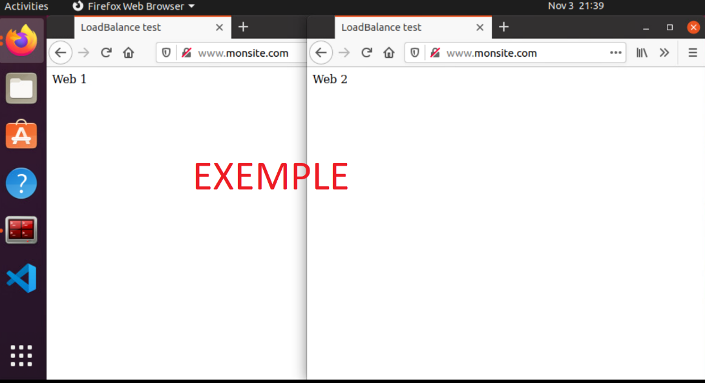

# Exercice 16 – Nginx équilibreur/répartiteur de charge

## Informations

- Évaluation : formative.  
- Type de travail : individuel.  
- Durée estimée : 3 heures.  
- Système d'exploitation : Windows, Ubuntu client.  
- Environnement : Docker.  

## Objectifs  

L'exercice vise à :  

- Réaliser une installation complète d'un site Web avec nginx.  
- Configurer nginx comme équilibreur/répartiteur de charge (load balancer).  

## Description  

Dans cet exercice, nous allons mettre en place un site Web complet comprenant un serveur Web nginx, un serveur PHP et un serveur MySQL (ou MariaDB).  

Nous allons aussi voir comment utiliser nginx comme équilibreur de charge (load balancer).  

## Partie 1 : Installation complète d'un site Web

Dans cette partie, vous allez refaire l'installation d'un site Web complet que vous avez déjà fait avec Apache, mais en l'adaptant pour nginx.

### Étape 1 : Installation  

Vous allez reproduire la structure de répertoire ci-dessous. Les fichiers à l'intérieur des répertoires seront créés dans les prochaines sous-étapes.  

```bash
  /home/$user/Dev/SiteWeb/
                  |-- compose.yaml
                  |monsite/
                    |conf/
                      |-- default.conf
                    |html/
                      |-- index.php
                  |--php/
                    |-- Dockerfile
             
```  

#### Configuration PHP pour Nginx  

- Comme pour Apache, nous devons activer php dans les configurations de nginx. Comme vu précédemment, les configurations d’un serveur se font dans le contexte ```server```.    
- Sous ```monsite/conf```, créer un fichier ```default.conf``` configuré pour prendre en charge php :  

```conf
# default.conf
server {
    listen       80;
    listen  [::]:80;
    server_name  monsite.com www.monsite.com;

    #access_log  /var/log/nginx/host.access.log  main;

    root   /usr/share/nginx/html;
    index  index.php index.html index.htm;

    location / {
        try_files $uri $uri/ /index.php?$query_string;
    }

    #error_page  404              /404.html;

    # redirect server error pages to the static page /50x.html
    error_page   500 502 503 504  /50x.html;
    location = /50x.html {
        root   /usr/share/nginx/html;
    }
    
    # PHP-FPM Configuration pour php
    location ~\.php$ {
        try_files $uri = 404;
        fastcgi_split_path_info ^(.+\.php)(/.+)$;
        fastcgi_pass php:9000;
        fastcgi_index index.php;
        include fastcgi_params;
        fastcgi_param REQUEST_URI $request_uri;
        fastcgi_param SCRIPT_FILENAME $document_root$fastcgi_script_name;
        fastcgi_param PATH_INFO $fastcgi_path_info;
    }

    # deny access to .htaccess files
    #location ~ /\.ht {
    #    deny  all;
    #}
}
```  

#### Spécifications du site Web  

**Note :** Pour le reste de la configuration, vous pouvez récupérer certains fichiers déjà créés pour Apache.  

**Fichiers index.php**

- Utiliser le fichier `index.php` de l'exercice 14, partie 1.  

**Fichier Dockerfile de php**

- Créer un Dockerfile personnalisé.  
- Mettre à jour PHP.  
- Installer l'extension mysqli.  
- Vous pouvez tout simplement récupérer le fichier Dockerfile de l'exercice 14, partie 1.  

**Fichier compose.yaml**

- Comme pour le site Web complet avec Apache, vous avez besoin de 3 services : PHP, nginx, MySQL/MariaDB. Consultez le fichier ```compose.yaml``` de l'exercice 14, partie 1, et créer un fichier ```compose.yaml``` pour pouvoir lancer un site Web complet avec nginx.  
- Voici quelques informations dont vous devez tenir compte :  

1. **php**
   - Mappage : le répertoire de documents racine de nginx est ```/usr/share/nginx/html```.  

2. **nginx :**
   - Image : nginx:alpine.  
   - Port : 80.  
   - Conserver les journaux (logs) par défaut.  
   - Conserver l'emplacement de documents racine de nginx par défaut.  
   - Fichier de configurations : utiliser un mappage pour les fichiers de configurations, ```monsite/conf → /etc/nginx/conf.d```.   

3. **mysql/mariadb :**
   - Configurer le redémarrage automatique (le conteneur repart s’il arrête involontairement).  
   - Créer un volume persistant ```dbdata```.  

#### Test du site  

- Vérifier le bon fonctionnement du site Web ([http://www.monsite.com](http://www.monsite.com)) après l'installation.

#### Arrêt du système  

- Procéder à l'arrêt propre (efface les images et les volumes créés) du système une fois les tests terminés.

```bash
docker compose down --rmi local -v
```  

## Partie 2 : Load Balancer  

Cette partie traite de la configuration de nginx comme équilibreur de charge entre deux serveurs Web.

En plus d'être un serveur Web et de cache, NGINX est également un équilibreur de charge. Son style de configuration est flexible, mais quelque peu non évident.

### Étape 1 : Création de la structure  

#### Structure des fichiers  

- Créez l'arborescence suivante sous le répertoire ```Dev``` :  

**Note :** ne pas créer les fichiers, ils seront créés plus loin.  

```bash
LoadBalancer/
  |-- compose.yaml
  |nginx/
    |-- default.conf     
  |web1/
    |html/
      |-- index.html
  |web2/
    |html/
      |-- index.html
```  

#### Architecture du système  

La configuration permettra à nginx de rediriger le trafic pour www.monsite.com vers deux serveurs Apache (httpd) en mode round robin :  

```bash
                       |-- web1 (httpd)
www.monsite.com── nginx|
                       |-- web2 (httpd)
```  

#### Fichiers index.html  

- Pour visualiser la répartition de charge entre les deux serveurs Apache, créez deux pages ```index.html``` distinctes pour chaque serveur.

### Étape 2 : Configuration  

#### Configuration du module Upstream  

- Le module ```upstream``` de nginx permet de créer un groupe nommé de serveurs. La configuration suivante définit les serveurs ```monsite-servers``` comme une collection de deux serveurs. La configuration doit être faite dans le contexte ```http```. Vous allez placer la configuration au début du fichier ```default.conf```, dans aucun contexte (il se retrouve, par défaut, dans le contexte ```http``` du fichier ```nginx.conf```). Le contexte ```server``` suivra cette configuration :  

```conf
upstream monsite-servers {
    server web1 max_fails=2;
    server web2 max_fails=2;
}
```  

#### Configuration du Virtual Host  

- À la suite du contexte ```upstream```, ajoutez le contexte ```server``` suivant dans le fichier ```default.conf``` :  

```conf
server {
    listen 80;
    server_name monsite.com www.monsite.com;

    location / {
        proxy_pass         http://monsite-servers;
        proxy_redirect     off;
        proxy_set_header   Host $host;
        proxy_set_header   X-Real-IP $remote_addr;
        proxy_set_header   X-Forwarded-For $proxy_add_x_forwarded_for;
        proxy_set_header   X-Forwarded-Host $server_name;
    }
}
```  

Les groupes upstream peuvent être référencés à partir de définitions d'hôte virtuel. En particulier, ils peuvent être utilisés comme destinations de proxy, tout comme les noms d'hôte. Dans le contexte ```server``` ci-dessus, vous faites une configuration pour que le trafic pour monsite.com et www.monsite.com soit détourné vers les serveurs web1 et web2 (définit dans le contexte ```upstream monsite-servers```) en round robin (par défaut).  

#### Descriptions des directives Proxy  

- ```proxy_pass``` : Définit l'adresse du serveur proxy. Comme nous avons un contexte ```upstream``` avec ce nom, les requêtes seront redirigées vers ce contexte.  
- ```proxy_redirect``` : Contrôle la réécriture des métadonnées (en-têtes) ```Location``` et ```Refresh``` de la requête.  
- ```proxy_set_header Host``` : Définit le nom d'hôte du serveur de destination, ici www.monsite.com : définit la métadonnée ```Host``` de la requête.  
- ```proxy_set_header X-Real-IP``` : Transmet l'IP réelle du client aux serveurs.  
- ```proxy_set_header X-Forwarded-For``` : Conserve la chaîne des adresses IP : l'adresse du client, l'adresse du proxy.   
- `proxy_set_header X-Forwarded-Host` : Transmet le nom d'hôte original : www.monsite.com.  

#### Configuration Docker Compose  

```yaml
# compose.yaml
---
services:
  proxy:
    image: nginx:alpine
    ports:
      - '80:80'
    volumes:
      - ./nginx/default.conf:/etc/nginx/conf.d/default.conf:ro
  web1:
    image: httpd:alpine
    volumes:
      - ./web1/html:/usr/local/apache2/htdocs/
  web2:
    image: httpd:alpine
    volumes:
      - ./web2/html:/usr/local/apache2/htdocs/
```  

#### Test et Vérification  

1. Lancez les conteneurs :  

```bash
docker compose up -d
```

2. Testez l'équilibrage en rafraîchissant la page plusieurs fois.

#### Liaison entre Conteneurs  

La résolution des noms ```web1``` et ```web2``` dans la clause ```upstream``` fonctionne grâce au DNS intégré de Docker. Docker Compose crée automatiquement un réseau où les services peuvent se référencer par leur nom.  

#### Nettoyage  

Pour arrêter et supprimer les conteneurs :  

```bash
docker compose down
```  

## Vérification  

Fournir une capture d'écran de Linux montrant :  

- Deux fenêtres Firefox ouvertes.  
- Chacune affichant [www.monsite.com](http://www.monsite.com).  
- Démontrant les deux sites Web différents du load balancer.  


  
**Figure 1 : exemple de remise.**  


## Compétences développées

00SJ – Effectuer le déploiement de serveurs intranet. 	
- 00SJ # 2 – Monter les serveurs intranet.
- 00SJ # 3 – Installer les services intranet.
- 00SJ # 5 – Participer à la mise en service des serveurs intranet.

*Note : Ces compétences sont développées partiellement*

## Références

* Documentation officielle Nginx
  - <https://nginx.org/en/docs/>  
  - <https://docs.nginx.com/nginx/admin-guide/>  
  - <https://nginx.org/en/docs/http/load_balancing.html>  
  - <https://nginx.org/en/docs/http/ngx_http_proxy_module.html>  

* Ressources Docker
  - <https://hub.docker.com/_/nginx>  

* Tutoriels
  - <https://adoltech.com/blog/how-to-set-up-nginx-php-fpm-and-mysql-with-docker-compose/>  


### Solutions 

<details>  
<summary>Voir la solution de l'étape 1.</summary>  

```yaml
# compose.yaml
---
services:
  php:
    build: './php/'
    networks:
      - backend
    environment:
      - DB_USER=root
      - DB_PASSWD=rootpassword
    volumes:
      - ./monsite/html:/usr/share/nginx/html
  apache:
    image: nginx:alpine
    depends_on:
      - php
      - mariadb
    networks:
      - frontend
      - backend
    ports:
      - "80:80"
    volumes:
      - ./monsite/html:/usr/share/nginx/html
      - ./monsite/conf:/etc/nginx/conf.d
  mariadb:
    image: mariadb:latest
    restart: always
    networks:
      - backend
    environment:
      - MYSQL_ROOT_PASSWORD=rootpassword
    volumes:
      - dbdata:/var/lib/mysql

networks:
  frontend:
  backend:
volumes:
  dbdata:
```  

```conf
# default.conf
server {
    listen       80;
    listen  [::]:80;
    server_name  monsite.com www.monsite.com;

    #access_log  /var/log/nginx/host.access.log  main;

    root   /usr/share/nginx/html;
    index  index.php index.html index.htm;

    location / {
        try_files $uri $uri/ /index.php?$query_string;
    }

    #error_page  404              /404.html;

    # redirect server error pages to the static page /50x.html
    error_page   500 502 503 504  /50x.html;
    location = /50x.html {
        root   /usr/share/nginx/html;
    }

    # PHP-FPM Configuration pour php
    location ~\.php$ {
        try_files $uri = 404;
        fastcgi_split_path_info ^(.+\.php)(/.+)$;
        fastcgi_pass php:9000;
        fastcgi_index index.php;
        include fastcgi_params;
        fastcgi_param REQUEST_URI $request_uri;
        fastcgi_param SCRIPT_FILENAME $document_root$fastcgi_script_name;
        fastcgi_param PATH_INFO $fastcgi_path_info;
    }

    # deny access to .htaccess files
    #location ~ /\.ht {
    #    deny  all;
    #}
}

```  

```php
<!-- index.php -->
<h1>Je te test!</h1>
<h4>Tentative de connexion MariaDB depuis PHP...</h4>
<?php
$host = 'mariadb';
$user = $_ENV["DB_USER"];
$pass = $_ENV["DB_PASSWD"];
$conn = new mysqli($host, $user, $pass);

if ($conn->connect_error) {
    die("La connexion a échoué: " . $conn->connect_error);
}
echo "Connexion réussie à MariaDB!";
?>
```  
```Dockerfile
# Dockerfile
# Utilise une petite image
FROM php:fpm-alpine

# Mets a jour le serveur
RUN apk update; \
    apk upgrade;

# Install mysqli extension  permettant d'utiliser la bd dans PHP
RUN docker-php-ext-install mysqli
```  

</details>