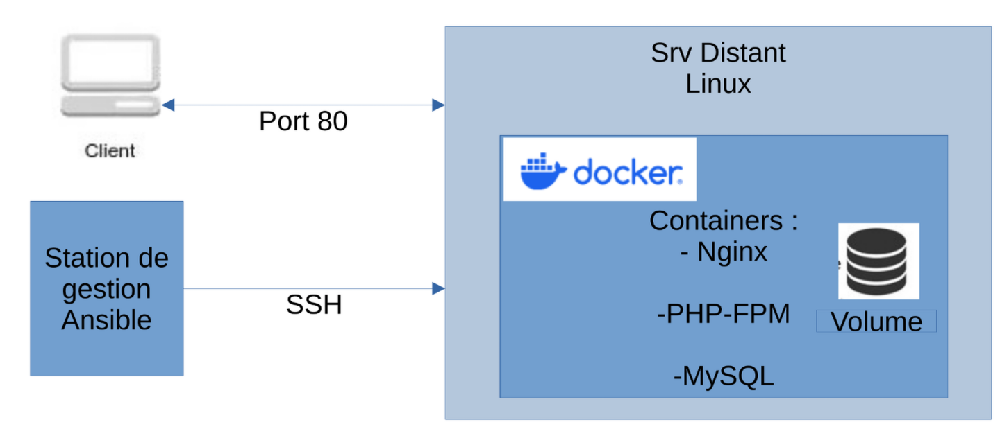
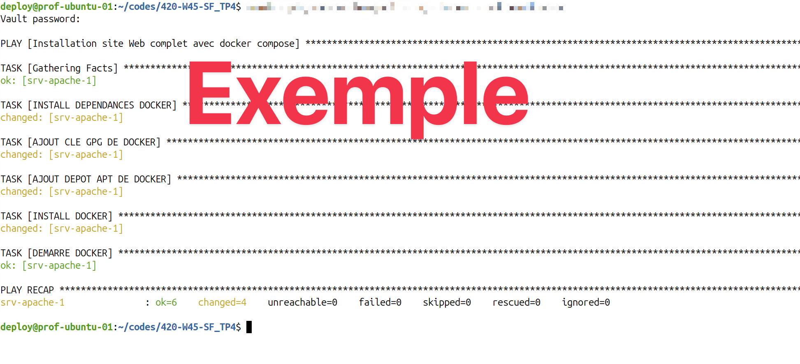
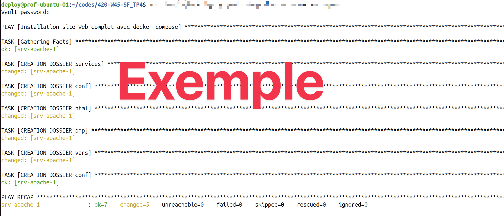
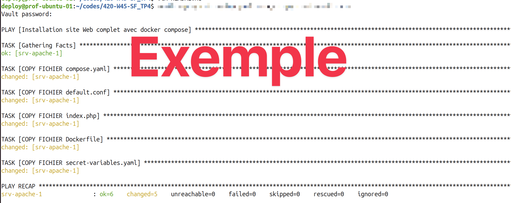
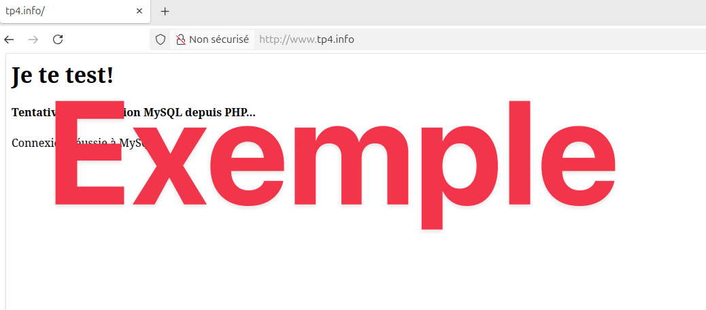

# Évaluation finale à caractère synthèse  

## Informations  

- Évaluation : 30 % de la session.  
- Type de travail : individuel.  
- Date de remise : voir sur Léa.  
- Durée : 6 heures en classe.  
- Système d’exploitation : Linux / Docker.  
- Environnement : virtuel / Docker.  

## Compétences évaluées

- Analyser le projet de déploiement.  
- Monter le serveurs Internet ou intranet.  
- Appliquer des procédures d’installation des services Internet conformément aux procédures et spécifications techniques.  
- Configurer des services Internet selon la documentation ou le plan de conception (Ex. : architecture réseau, technologique, etc.).  
- Tester adéquatement le fonctionnement des services Internet.  
- Activer des services Internet selon les procédures recommandées.  
- Appliquer des correctifs et des mises à jour sur les systèmes d’exploitation serveur.  

## Mise en contexte  

Cette épreuve à caractère synthèse est un travail pratique où vous aurez plusieurs tâches à accomplir pour vérifier les compétences ci-dessus.

## Prérequis  
- Une machine de gestion avec Ansible installé.  
- Une VM distante dans l'infrastructure virtuelle vSphere du Cégep.  
  - Vous pouvez utiliser un de vos deux serveurs srv-apache-1 ou srv-mysql-1. Si vous utilisez srv-apache-1, n'oubliez pas d'arrêter le conteneur ```webapp``` du TP4.
- Accès SSH sans mot de passe à la VM distante depuis la machine de gestion.  

## Description du projet  

Vous allez déployer une application Web simple comprenant les composants suivants :  

   - Nginx : Serveur web pour gérer les requêtes HTTP.  
   - PHP (FPM) : Interprète PHP pour exécuter le code de l'application.  
   - MySQL : Serveur de base de données pour stocker les données de l'application.  

L'ensemble de ces composants sera déployé en tant que conteneurs Docker sur votre VM distante, orchestrés par Docker Compose. Ansible sera utilisé pour automatiser l'installation de Docker, Docker Compose (inclus dans docker), les dépendances nécessaires sur la VM et le système complet pour l'application.  

## Étapes détaillées

 1- Configuration de l'environnement Ansible :  
  - Créer un inventaire Ansible pour définir votre VM distante.  
  - Vérifier la connectivité SSH sans mot de passe.  
 
 2- Création du playbook Ansible :  
   - Installer les dépendances nécessaires pour le module Docker d'Ansible.  
   - Installer Docker et Docker Compose sur la VM distante.  
   - Démarrer et activer le service Docker.  
 
 3- Déploiement de l'application avec Docker Compose :  
   -  Créer un fichier ```compose.yaml``` définissant les services Nginx, PHP-FPM et MySQL (vous pouvez utiliser l'exercice 16 pour vous aider).  
   -  Configurer les variables d'environnement pour les conteneurs (par exemple, les informations de connexion à la base de données).  
   -  Utiliser des volumes Docker pour la persistance des données de la base de données et et des volumes pour les fichiers nécessaires au système et à l'application.  
   -  Le site Web doit répondre à <http://www.efcs.info> et <http://efcs.info>. Configurer votre machine de gestion pour associer l'adresse IP de la VM distante à ces noms.  
     
 4-  Configuration des services web :   
   -  Créer un fichier de configuration Nginx pour diriger les requêtes vers le conteneur PHP-FPM.  
   -  Utiliser une page ```index.php``` pour tester la connexion à la base de données.  
   -  Placer le fichier ```index.php``` dans le dossier html qui sera monté en volume dans les conteneurs de nginx et php.  

 5- Compléter le playbook Ansible :  
   - Vous devez créer la structure de répertoire sur le serveur.  
   - Vous devez copier les fichiers sur le serveur pour les services Docker Compose.  
   - Vous devez configurer le lancement du système avec docker compose v2.  

 6- Exécution du playbook Ansible :  
   - Exécuter le playbook Ansible pour déployer l'application sur la VM distante.  
   - Vérifier que les conteneurs sont en cours d'exécution et que l'application est accessible via un navigateur web.  
   - Dans votre playbook, vous devez prévoir de relancer les services (si vous avez fait un changement à un fichier) et arrêter les services.  
     
 7- Tests et validation :  
  - Vérifier que la page ```index.php``` affiche les informations de connexion à la base de données.  
  - Vérifier les journaux des conteneurs pour identifier les éventuelles erreurs.  

## Description de l'infrastructure  

Vous allez utiliser une structure comme celle-ci :  

  
**Figure 1 : schéma du EFCS.**  

## Points importants  

 - Utiliser des variables et *tags* Ansible pour rendre votre code plus modulaire et réutilisable.  
 - Utiliser ansible-vault, avec le mot de passe **secret**, pour le chiffrement des informations sensibles.  
 - Documenter votre code avec des commentaires clairs et concis.  
 - Débuter par faire fonctionner votre application avec Docker Compose localement avant de le faire fonctionner sur la VM distante.  
 - Monter votre fichier de déploiement graduellement :  
   1- Test l'installation de Docker.  
   2- Test la création de dossiers.  
   3- Test la copie des fichiers des services et de l'application.  
   4- ...
 - Tester votre code régulièrement pour identifier et corriger les erreurs.  
 - Utiliser le système de contrôle de version (Git) pour gérer votre code.  

## Remise

1- Sur léa :  
  - Un fichier texte avec l'URL du dépôt GitHub et l'adresse IP de la VM distante (vous pouvez la laisser allumée, je vais la fermer de mon côté).  

2- Dépôt GitHub privé :  
   - Code source complet du projet (playbook Ansible, fichier compose.yaml, fichiers de configuration Nginx et PHP...).  
   - Fichier README.md décrivant le projet, les instructions d'installation et d'utilisation. Des images, voir la section "Exemple d'images", démontrant le fonctionnement du TP.    
   - Naturellement, je dois être collaborateur du dépôt github.  

3- Documentation :  
  -  Lister les sites de références utilisées.  

## Exemple d'images  

Voici des exemples d'images à inclure dans votre dépôt github. Les informations dans les images peuvent varier selon la manière que vous avez créé votre projet. Mais, l'information principale doit être la même.  

  
**Figure 2 : exemple de vérification de connexion ssh.**  

  
**Figure 3 : exemple de l'installation de Docker.**  

  
**Figure 4 : exemple de création de répertoires/dossiers.**  

  
**Figure 5 : exemple de copie de fichiers.**  

  
**Figure 6 : exemple de page Web avec connexion à la BD.**  

  
**Figure 7 : exemple de journaux du serveur Web.**  


## Évaluation :  

| Item                  | Points | Résultat | Commentaires|  
| --------------------- | -----: | :-------: | :----|  
| Configuration, installation de Docker sur la VM distante |    10 |           | |  
| Utilisation appropriée des variables, *tags* Ansible et Docker compose|    20 |  |  |  
| Page Web d'identification fonctionnelle |20 |   |  |  
| Fichiers de configurations clairs et **bien documentés** |    50 |   |  |  
| **Total**             | **100** |   |  |  

## Références :  

[Documentation officielle d'Ansible](https://docs.ansible.com)  
[Documentation de Ansible Community.Docker](https://docs.ansible.com/ansible/latest/collections/community/docker/index.html#description)  
[Documentation ansible pour copy](https://docs.ansible.com/ansible/latest/collections/ansible/builtin/copy_module.html)  
[Documentation officielle de Docker](https://docs.docker.com)  
[How to run docker-compose commands with ansible?](https://stackoverflow.com/questions/62452039/how-to-run-docker-compose-commands-with-ansible#62452959)  
[Ansible Docker modules](https://docs.ansible.com/ansible/latest/collections/community/docker/index.html#description)  
[Ansible mange Docker containers](https://docs.ansible.com/ansible/latest/collections/community/docker/docker_container_module.html#ansible-collections-community-docker-docker-container-module)  
[Documentation pour l'utilisation de la fonction `php_uname`](https://www.php.net/manual/en/function.php-uname.php)  
[Documentation ansible pour copy](https://docs.ansible.com/ansible/latest/collections/ansible/builtin/copy_module.html)  
[Documentation ansible pour file](https://docs.ansible.com/ansible/latest/collections/ansible/builtin/file_module.html#file-module)  